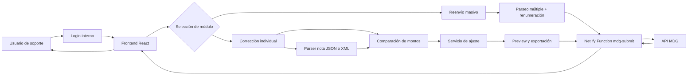
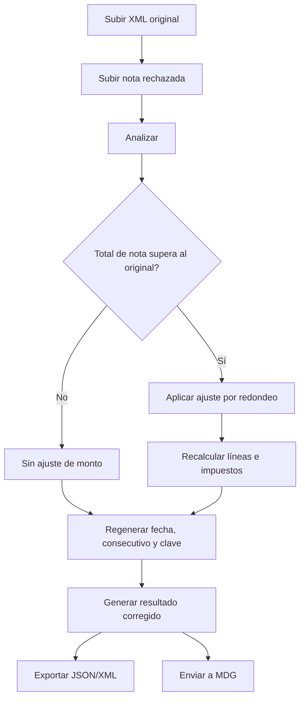
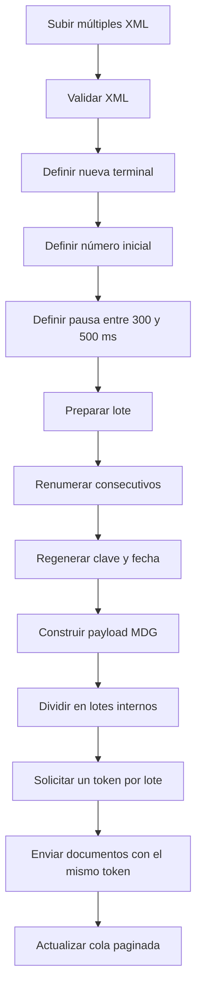
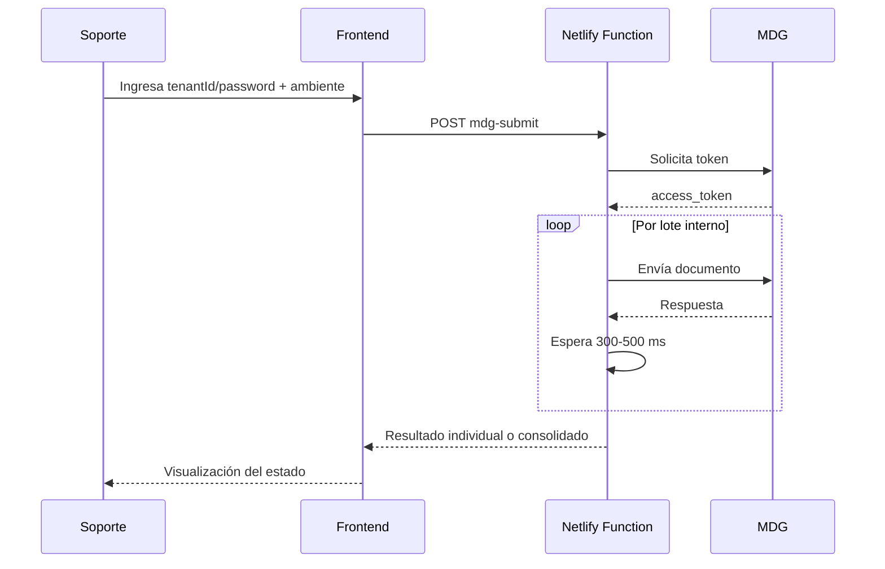

# Documento de Configuración

## Control de Versiones

| Versión | Fecha de elaboración | Descripción |
| --- | --- | --- |
| 1.0 | 15/04/2026 | Creación de la guía en su primera versión. |
| 1.1 | 04/05/2026 | Se agrega módulo de reenvío masivo, paginación de cola y envío por lotes con token reutilizado. |

## Datos Generales

| Campo | Valor |
| --- | --- |
| Área / Servicio / Unidad propietaria del documento | Departamento de Ingeniería |
| Elaborado por | Felipe Alvarez |
| Aprobado por | Ricardo Plaz |
| Fecha de aprobación | 15/04/2026 |
| Nombre del sistema | hioposutil |
| Tipo de solución | Herramienta web interna |
| Entorno objetivo | Netlify + Netlify Functions |

## Contenido

1. [Introducción](#introducción)
2. [Objetivo del sistema](#objetivo-del-sistema)
3. [Arquitectura general](#arquitectura-general)
4. [Prerrequisitos](#prerrequisitos)
5. [Configuración técnica](#configuración-técnica)
6. [Uso del sistema](#uso-del-sistema)
7. [Módulo de reenvío masivo](#módulo-de-reenvío-masivo)
8. [Proceso de envío a MDG](#proceso-de-envío-a-mdg)
9. [Autenticación interna](#autenticación-interna)
10. [Glosario de términos](#glosario-de-términos)
11. [Versionamiento](#versionamiento)
12. [FAQ y solución de errores comunes](#faq-y-solución-de-errores-comunes)

## Introducción

Este documento describe el funcionamiento, configuración y operación de la herramienta interna `hioposutil`, desarrollada para corregir notas de crédito electrónicas rechazadas por diferencias de redondeo respecto al documento original y reenviarlas posteriormente a MDG.

El sistema fue diseñado para ser utilizado por personal de soporte interno, con una interfaz web controlada, autenticación interna simple y un flujo asistido para:

- cargar documentos originales
- analizar la nota rechazada
- recalcular montos permitidos
- regenerar datos fiscales necesarios
- exportar el resultado corregido
- reenviar el comprobante a MDG mediante una Netlify Function
- reprocesar lotes completos de XML con numeración secuencial

La solución evita problemas de CORS al no realizar llamadas directas desde el navegador hacia MDG.

## Objetivo del sistema

El objetivo principal del sistema es automatizar el proceso de corrección de notas de crédito electrónicas que son rechazadas por Hacienda o por MDG cuando el total de la nota supera al documento original debido a diferencias pequeñas de redondeo.

La herramienta permite:

- tomar como fuente de verdad el XML del documento original
- aceptar una nota rechazada en JSON o XML
- detectar si el total de la nota es mayor al permitido
- ajustar el total para dejarlo entre 1 y 2 colones por debajo del original cuando corresponde
- generar una nueva fecha, un nuevo consecutivo y una nueva clave usando una terminal definida por soporte
- reenviar el comprobante a MDG de forma controlada
- cargar lotes de XML para reenvío masivo
- renumerar documentos secuencialmente a partir de un número inicial
- reutilizar un mismo token MDG por lote interno para reducir presión sobre el servicio

## Arquitectura general

### Arquitectura funcional



### Flujo de proceso



### Flujo de reenvío masivo



## Prerrequisitos

Para utilizar y desplegar el sistema se requiere:

1. Node.js 18 o superior.
2. npm instalado.
3. Acceso al repositorio GitHub del proyecto.
4. Cuenta en Netlify con acceso al equipo `HIOPOS`.
5. Credenciales MDG válidas por cliente:
   - `tenantId`
   - `password`
6. Navegador moderno para uso del sistema.

## Configuración técnica

### Stack tecnológico

- Vite
- React
- TypeScript
- Tailwind CSS
- Framer Motion
- Sonner
- Netlify Functions

### Estructura relevante

```text
src/
  components/
  parsers/
  services/
  utils/
  types/
netlify/
  functions/
    mdg-submit.mjs
netlify.toml
package.json
```

### Componentes y servicios agregados para reenvío masivo

- `src/components/ModuleSwitcher.tsx`
- `src/components/BulkUploadPanel.tsx`
- `src/components/BulkReissueSettingsPanel.tsx`
- `src/components/BulkQueuePanel.tsx`
- `src/components/BulkResendModule.tsx`
- `src/services/bulkResendService.ts`
- `src/utils/mdgValidation.ts`

### Configuración de build en Netlify

| Campo | Valor |
| --- | --- |
| Branch to deploy | `main` |
| Base directory | vacío |
| Build command | `npm run build` |
| Publish directory | `dist` |
| Functions directory | `netlify/functions` |

### Scripts disponibles

| Script | Descripción |
| --- | --- |
| `npm run dev` | Inicia Vite en local |
| `npm run dev:netlify` | Inicia Netlify Dev con Functions |
| `npm run build` | Genera build de producción |
| `npm run lint` | Ejecuta ESLint |
| `npm run typecheck` | Valida tipos TypeScript |
| `npm run preview` | Previsualiza el build |

## Uso del sistema

El flujo operativo del sistema consta de los siguientes pasos:

### Paso 1 — Ingreso al sistema

El usuario debe iniciar sesión con las credenciales internas:

| Campo | Valor |
| --- | --- |
| Usuario | `soporte` |
| Contraseña | `1965` |

La sesión:

- queda activa en caché del navegador
- puede cerrarse manualmente
- vence tras 5 horas de inactividad
- muestra advertencia antes del vencimiento

### Paso 2 — Carga del documento original

El usuario puede:

- cargar un XML original, o
- ingresar manualmente datos mínimos del documento base

Datos relevantes tomados del documento original:

- clave
- número consecutivo
- fecha de emisión
- tipo de documento
- total comprobante
- impuestos
- otros cargos

### Paso 3 — Carga de la nota rechazada

El sistema acepta:

- JSON requerido por MDG
- XML de nota de crédito

### Paso 4 — Análisis

El usuario presiona `Analizar documento`.

El sistema:

- compara total original contra total de la nota
- determina la diferencia
- indica si la nota supera o no el monto permitido

### Paso 5 — Configuración de reemisión

El usuario debe indicar una nueva terminal para:

- generar un nuevo consecutivo
- generar una nueva clave

La terminal:

- debe tener 5 dígitos
- no debe ser igual a la terminal original

### Paso 6 — Recálculo

El usuario presiona `Recalcular ajuste`.

El sistema:

- intenta reducir la nota por otros cargos o líneas de detalle
- actualiza impuestos y resumen
- busca dejar la nota entre 1 y 2 colones por debajo del original

### Paso 7 — Generación de resultado

El usuario presiona `Generar versión corregida`.

El sistema genera:

- JSON corregido
- XML corregido
- preview en pantalla

### Paso 8 — Envío a MDG

El usuario:

- selecciona ambiente `Testing` o `Producción`
- ingresa `tenantId`
- ingresa `password`
- presiona `Enviar a MDG`

Si el envío es exitoso:

- se muestra la respuesta de MDG
- el formulario se limpia automáticamente
- el sistema queda listo para procesar el siguiente caso

## Módulo de reenvío masivo

El sistema ahora incorpora un segundo flujo de trabajo orientado a soporte operativo cuando se deben reprocesar varios comprobantes XML en serie.

### Objetivo del módulo

Permitir que una persona:

- cargue múltiples XML
- defina una nueva terminal
- defina un número inicial para la secuencia
- decida si regenerar o no el segmento de seguridad de la clave
- envíe el lote a MDG de forma controlada

### Reglas operativas del módulo

- el orden del lote corresponde al orden en que se cargan los XML
- el primer documento toma el número inicial indicado
- los siguientes avanzan secuencialmente de uno en uno
- la cola se muestra paginada para soportar cientos o miles de registros
- la pausa entre emisiones se configura entre `300` y `500 ms`
- el lote se divide en grupos internos de hasta `10` documentos
- cada grupo interno solicita un solo token y reutiliza ese token en sus emisiones

### Beneficios

- reduce la cantidad de solicitudes de token a MDG
- disminuye la probabilidad de castigo o saturación
- facilita operar lotes grandes desde una sola interfaz
- deja trazabilidad visual por documento en la cola

## Proceso de envío a MDG

El sistema no llama a MDG directamente desde el navegador.

### Flujo técnico



### Beneficios del enfoque

- evita CORS
- no expone endpoints en pantalla
- permite usar credenciales distintas por cliente
- deja posibilidad de usar variables de entorno como fallback
- reduce la cantidad de solicitudes de token en lotes masivos
- introduce pacing controlado para proteger el servicio externo

## Autenticación interna

La herramienta posee una autenticación interna básica para evitar acceso casual al sistema.

### Comportamiento de sesión

- login obligatorio al abrir la aplicación
- persistencia local hasta cierre manual o inactividad
- advertencia visual antes del vencimiento
- renovación de la sesión mientras la persona siga usando la app

### Cierre de sesión

Se puede cerrar sesión desde el header mediante el botón `Cerrar sesión`.

## Glosario de términos

| Término | Definición |
| --- | --- |
| XML | Formato estructurado de intercambio de datos |
| JSON | Formato estructurado de datos usado por APIs |
| Nota de crédito | Documento electrónico de corrección o anulación |
| Clave | Identificador fiscal del comprobante electrónico |
| Consecutivo | Secuencia fiscal del documento |
| Terminal | Segmento configurable usado para regenerar consecutivo y clave |
| MDG | Plataforma intermediaria de emisión |
| Function | Función serverless usada para operar del lado servidor |
| CORS | Restricción del navegador para llamadas entre dominios |
| Lote interno | Grupo de hasta 10 documentos procesados con el mismo token |
| Pacing | Pausa controlada entre solicitudes consecutivas |

## Versionamiento

El proyecto sigue un versionamiento funcional incremental.

| Tipo de cambio | Impacto |
| --- | --- |
| Ajustes visuales menores | Compatible |
| Nuevos campos de apoyo | Compatible |
| Nuevas reglas de validación | Compatible con revisión operativa |
| Cambios en estructura del JSON de salida | Requiere validación contra MDG |
| Cambios en flujo de autenticación | Requiere aviso al equipo de soporte |
| Cambios en lotes internos o pacing | Requiere validación operativa con MDG |

## FAQ y solución de errores comunes

### ¿Por qué la app no llama directo a MDG?

Porque el navegador bloquearía la solicitud por CORS. Por eso el envío se hace mediante una Netlify Function.

### ¿Qué pasa si las credenciales del cliente son incorrectas?

La Function obtendrá un error al solicitar el token o al emitir el comprobante y el sistema mostrará el detalle en pantalla.

### ¿Qué pasa si el total de la nota ya está dentro del rango permitido?

El sistema puede regenerar la identidad fiscal sin aplicar un ajuste de monto.

### ¿Qué pasa si la sesión vence?

El sistema advertirá antes del vencimiento y cerrará la sesión si no hay actividad.

### ¿Qué sucede después de un envío exitoso a MDG?

La herramienta limpia el caso actual y deja la pantalla lista para procesar el siguiente.

### ¿Cómo funciona el reenvío masivo?

La app prepara todos los XML, los renumera secuencialmente, los divide en lotes internos y usa un token por lote para emitir varios comprobantes con pausas cortas entre ellos.

### ¿Cada documento pide un token nuevo?

No en el módulo masivo. Actualmente el sistema reutiliza un token por lote interno.

### ¿Cuántos documentos procesa cada lote interno?

Actualmente hasta 10 documentos por lote interno.

### ¿Por qué existe una pausa entre documentos?

Para reducir presión contra MDG y disminuir riesgo de bloqueo, saturación o comportamiento agresivo contra el servicio.

### ¿Se puede procesar un lote muy grande?

Sí, pero el tiempo final dependerá de:

- cantidad de documentos
- latencia real de MDG
- pausa configurada
- cantidad de rechazos o reintentos

### ¿Las credenciales del cliente se guardan en el sistema?

No como configuración estática del sitio. Se usan para la operación actual dentro del flujo de envío.

### ¿Se puede usar esta herramienta en Testing y Producción?

Sí. El sistema permite seleccionar ambos ambientes antes de enviar.

## Observaciones finales

- Este documento corresponde a una guía interna de configuración y uso.
- Puede ser adaptado posteriormente a formato Word o PDF corporativo.
- Se recomienda revisar este documento cada vez que cambie el flujo de MDG, la autenticación o el formato de salida.

----------------------------------------- FIN DEL DOCUMENTO -----------------------------------------
