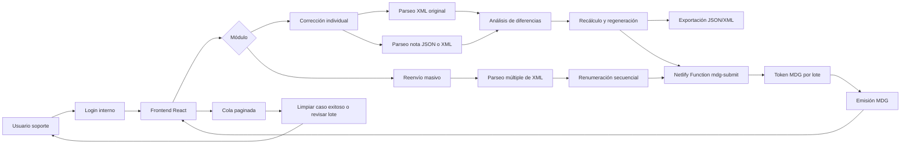
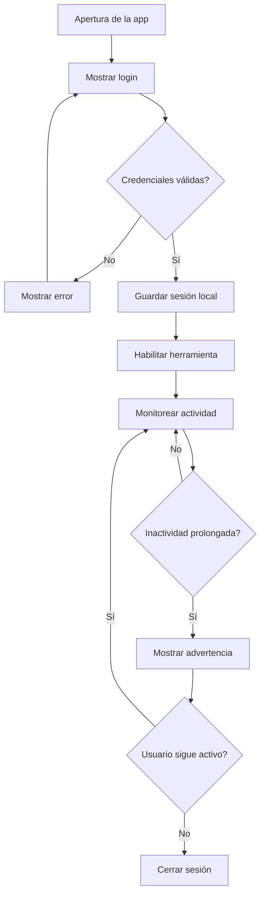
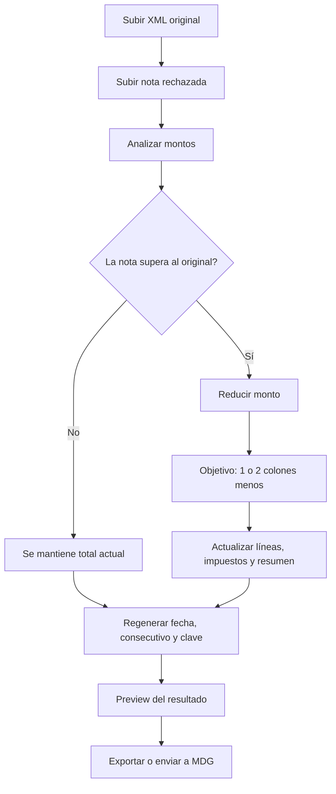
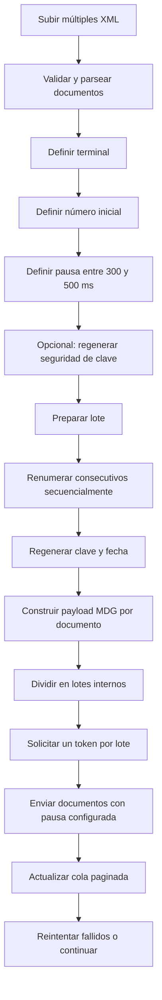

# hioposutil

Herramienta web interna para corregir notas de crédito electrónicas rechazadas por diferencias de redondeo frente al documento fiscal original, regenerar su información de reemisión y reenviarlas a MDG sin exponer endpoints directamente en el frontend.

## Objetivo

La aplicación permite:

- cargar el XML del documento original
- cargar la nota rechazada en JSON o XML
- analizar diferencias de total
- recalcular una versión corregida por debajo del original
- regenerar fecha, consecutivo y clave usando una nueva terminal
- exportar JSON y XML corregidos
- reenviar el comprobante a MDG usando una Netlify Function para evitar CORS
- operar con login interno y sesión persistente para personal de soporte
- procesar lotes de XML para reenvío masivo con numeración secuencial

## Stack

- Vite
- React
- TypeScript
- Tailwind CSS
- Framer Motion
- Sonner
- Netlify Functions

## Funcionalidades principales

- Login interno obligatorio antes de usar la herramienta
- Sesión persistente en navegador con cierre manual y expiración por inactividad
- Advertencia previa al vencimiento de sesión
- Soporte de documento original por XML o ingreso manual
- Soporte de nota de crédito rechazada en JSON MDG o XML
- Parseo robusto con validaciones y manejo de errores
- Ajuste automático de diferencias pequeñas de redondeo
- Regeneración de consecutivo, clave y fecha de emisión
- Módulo de reenvío masivo para múltiples XML
- Renumeración secuencial por lote usando número inicial configurable
- Reutilización de token MDG por lote interno
- Pausa configurable entre 300 y 500 ms para reducir presión sobre MDG
- Paginación en cola de procesamiento para lotes grandes
- Exportación de `JSON` y `XML`
- Envío a MDG por ambiente `Testing` o `Producción`
- Uso de `tenantId` y `password` por cliente sin dejarlos fijos en el sitio
- Limpieza automática del caso después de un envío exitoso a MDG

## Arquitectura



## Flujo de autenticación y sesión



## Flujo de corrección



## Flujo de reenvío masivo



## Flujo de envío a MDG

```mermaid
sequenceDiagram
    participant S as Soporte
    participant FE as Frontend
    participant NF as Netlify Function
    participant MDG as API MDG

    S->>FE: Inicia sesión y carga archivos
    S->>FE: Ingresa tenantId, password y ambiente
    S->>FE: Presiona Enviar a MDG
    FE->>NF: POST /.netlify/functions/mdg-submit
    Note over FE,NF: En individual se envía un payload; en masivo se envía un grupo interno
    NF->>MDG: Solicita token
    MDG-->>NF: access_token
    NF->>MDG: Envía comprobante(s) reutilizando el mismo token del lote
    MDG-->>NF: Respuesta por cada emisión
    NF-->>FE: Resultado estructurado o error
    FE-->>S: Muestra éxito o detalle del error
    FE-->>S: Limpia el formulario si el envío fue exitoso
```

## Estructura relevante

```text
src/
  components/
  parsers/
  services/
  utils/
  types/
netlify/
  functions/
    mdg-submit.mjs
netlify.toml
netlify.env.example
```

Componentes y servicios nuevos relevantes:

- `src/components/ModuleSwitcher.tsx`
- `src/components/BulkUploadPanel.tsx`
- `src/components/BulkReissueSettingsPanel.tsx`
- `src/components/BulkQueuePanel.tsx`
- `src/components/BulkResendModule.tsx`
- `src/services/bulkResendService.ts`
- `src/utils/mdgValidation.ts`

## Requisitos

- Node.js 18 o superior
- npm
- Cuenta en Netlify para deploy con Functions

## Instalación local

1. Instalar dependencias:

```bash
npm install
```

2. Levantar solo frontend:

```bash
npm run dev
```

3. Levantar frontend + Netlify Function local:

```bash
npm run dev:netlify
```

Importante:

- `npm run dev` no sirve para probar el envío a MDG por Function.
- Para probar el botón `Enviar a MDG` localmente debes usar `npm run dev:netlify`.

## Scripts disponibles

- `npm run dev`: inicia Vite
- `npm run dev:netlify`: inicia Netlify Dev con Functions
- `npm run build`: genera build de producción
- `npm run lint`: corre ESLint
- `npm run typecheck`: valida tipos TypeScript
- `npm run preview`: previsualiza el build

## Paso a paso de uso

### Corrección individual

1. Ingresar con el login interno de soporte.
2. Seleccionar el módulo `Corrección individual`.
3. Cargar el XML del documento original.
4. Cargar la nota de crédito rechazada en JSON o XML.
5. Revisar los resúmenes generados por la app.
6. Configurar la nueva terminal de reemisión.
7. Presionar `Analizar documento`.
8. Presionar `Recalcular ajuste`.
9. Presionar `Generar versión corregida`.
10. Revisar el preview JSON/XML.
11. Opcionalmente exportar archivos.
12. Seleccionar ambiente `Testing` o `Producción`.
13. Ingresar `tenantId` y `password` del cliente.
14. Presionar `Enviar a MDG`.
15. Si el envío es exitoso, la app limpia el caso actual para preparar el siguiente.

### Reenvío masivo

1. Ingresar con el login interno de soporte.
2. Seleccionar el módulo `Reenvío masivo`.
3. Cargar múltiples XML.
4. Definir nueva terminal.
5. Definir número inicial del consecutivo.
6. Definir pausa entre envíos de `300` a `500 ms`.
7. Elegir si se regenera o no la seguridad de la clave.
8. Seleccionar ambiente `Testing` o `Producción`.
9. Ingresar `tenantId` y `password` del cliente.
10. Presionar `Preparar lote`.
11. Revisar la cola paginada.
12. Presionar `Enviar lote a MDG`.
13. Revisar éxitos y errores por documento.
14. Reintentar fallidos si aplica.
15. Cerrar sesión manualmente desde el encabezado cuando corresponda.

## Despliegue en Netlify

### Opción recomendada

Conectar este repositorio a Netlify por Git para que despliegue:

- frontend desde `dist`
- Functions desde `netlify/functions`

### Configuración de build

Netlify ya puede leer esta configuración desde `netlify.toml`:

- Build command: `npm run build`
- Publish directory: `dist`
- Functions directory: `netlify/functions`

### Variables de entorno

La app ya no depende de credenciales fijas para operar con múltiples clientes, porque soporte puede escribir `tenantId` y `password` por cada envío.

Sin embargo, como respaldo opcional, puedes definir en Netlify:

- `MDG_TENANT_ID`
- `MDG_PASSWORD`
- `MDG_TENANT_ID_TEST`
- `MDG_PASSWORD_TEST`
- `MDG_TENANT_ID_PROD`
- `MDG_PASSWORD_PROD`

El archivo [netlify.env.example](./netlify.env.example) incluye esos nombres como referencia.

## Seguridad y operación

- El frontend no llama directamente a MDG, por lo que se evita el problema de CORS.
- Los endpoints de MDG no se muestran en la interfaz.
- El `tenantId` y `password` del cliente se usan para la operación actual y no quedan como configuración estática del sitio.
- La herramienta tiene login interno obligatorio antes de habilitar las acciones de negocio.
- La sesión permanece disponible mientras exista actividad del usuario y se invalida por inactividad prolongada.
- Existe advertencia de vencimiento de sesión antes del cierre automático.
- El módulo masivo reutiliza un token por lote interno en vez de pedir un token por documento.
- La Function aplica una pausa configurable entre 300 y 500 ms entre emisiones del lote.
- Actualmente cada lote interno procesa hasta 10 documentos para reducir riesgo de timeout en la Function.
- Si más adelante se requiere mayor seguridad, el siguiente paso recomendado es reemplazar el login fijo y la captura manual por autenticación real y almacenamiento seguro de credenciales por cliente.

## Consideraciones fiscales

- El XML original es la fuente de verdad para el documento base.
- La app intenta dejar la nota corregida entre 1 y 2 colones por debajo del total del documento original cuando hay diferencia de redondeo.
- En un flujo fiscal real normalmente debe generarse nueva fecha, nuevo consecutivo y nueva clave.
- Se recomienda siempre validar el resultado antes de reenviar a MDG.

## Troubleshooting

### El botón de envío devuelve error de Function no disponible

Usa `npm run dev:netlify` en local o despliega el sitio en Netlify conectado por Git.

### El envío responde con error de configuración

Ocurre si:

- no se ingresó `tenantId`
- no se ingresó `password`
- o la Function esperaba usar variables de entorno y no existen

### El envío responde con error de MDG

Revisar:

- credenciales del cliente
- ambiente correcto
- estructura final del documento
- respuesta mostrada en el panel de error

### El lote masivo va lento

Revisar:

- tamaño total del lote
- pausa configurada entre envíos
- latencia real de MDG
- cantidad de errores que obliguen a reintentos

### El lote masivo no avanza completo

Revisar:

- si la Function devolvió un error para el lote actual
- si el documento excede validaciones de MDG
- si hubo timeout o error de red en el grupo interno
- la cola paginada para identificar exactamente dónde quedó cada documento

### La sesión se cerró sola

Revisar si:

- el usuario estuvo inactivo por un periodo prolongado
- la advertencia de sesión fue ignorada
- se limpió almacenamiento del navegador

## Validaciones realizadas

El proyecto fue verificado con:

```bash
npm run typecheck
npm run lint
npm run build
```

## Licencia

Uso interno.
