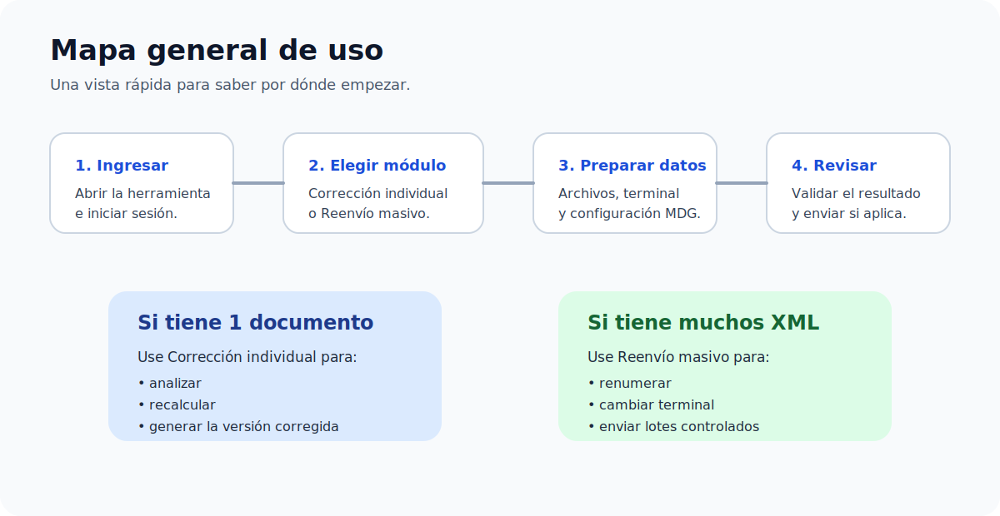

# Manual de uso de hioposutil

## Bienvenida

Este espacio reúne la documentación operativa de `hioposutil`, una herramienta pensada para ayudar al personal de soporte en la corrección y reemisión de comprobantes electrónicos.

La documentación fue organizada por páginas para que la consulta sea más simple dentro de GitBook.

## ¿Qué puede hacer la herramienta?

`hioposutil` permite trabajar en dos escenarios principales:

### Corrección individual

Se utiliza cuando una nota de crédito fue rechazada y se necesita revisar un solo caso, recalcular el monto permitido y generar una nueva versión del documento.

### Reenvío masivo

Se utiliza cuando se deben reprocesar muchos XML en la misma operación, aplicando nueva terminal, nueva numeración y envío controlado hacia MDG.

## ¿A quién está dirigida?

Esta herramienta está orientada a:

- personal de soporte
- usuarios operativos autorizados
- personas encargadas de atender incidencias documentales

## Requisitos básicos

Antes de comenzar, se recomienda contar con:

- acceso autorizado a la herramienta
- archivos válidos del caso a procesar
- credenciales MDG del cliente correcto
- claridad sobre si el trabajo se hará como corrección individual o como reenvío masivo

## Si es su primera vez

Se recomienda leer las páginas en este orden:

1. `Inicio rápido`
2. `Acceso y pantalla principal`
3. `Corrección individual` o `Reenvío masivo`, según el caso
4. `Configuración MDG`
5. `Mensajes y resultados`

## Estructura del manual

Este manual está dividido en las siguientes páginas:

- inicio rápido
- acceso y pantalla principal
- corrección individual
- reenvío masivo
- configuración MDG
- mensajes y resultados
- buenas prácticas y preguntas frecuentes
- glosario

## Control de versiones

| Versión | Fecha de elaboración | Descripción |
| --- | --- | --- |
| 1.0 | 15/04/2026 | Creación inicial del documento. |
| 1.1 | 04/05/2026 | Conversión del documento a manual operativo orientado a soporte. |
| 1.2 | 04/05/2026 | Reorganización del manual por páginas para GitBook. |

## Datos generales

| Campo | Valor |
| --- | --- |
| Área propietaria | Departamento de Ingeniería |
| Nombre de la herramienta | hioposutil |
| Tipo de documento | Manual de uso |
| Público objetivo | Soporte y usuarios operativos autorizados |
| Elaborado por | Felipe Alvarez |
| Aprobado por | Ricardo Plaz |
