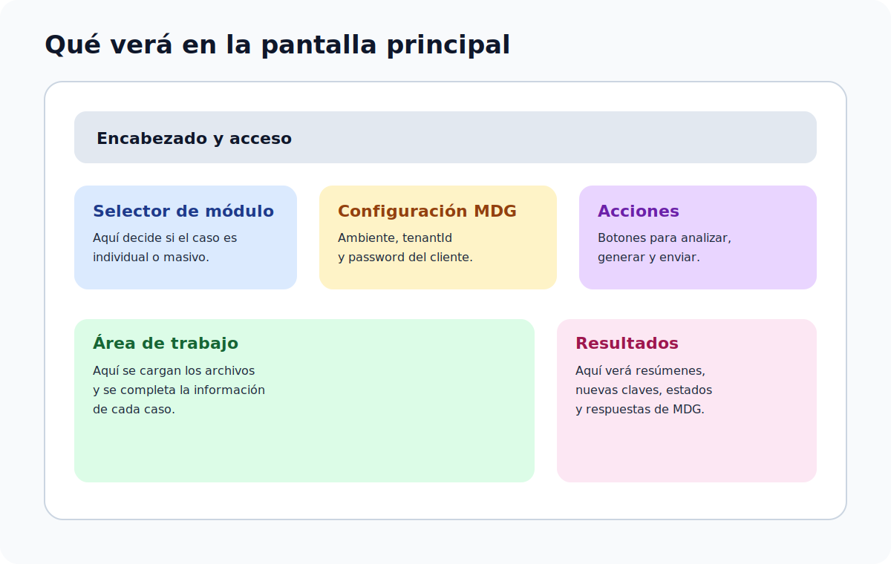

# Acceso y pantalla principal

## Ingreso al sistema

Al abrir la herramienta:

1. Se muestra la pantalla de acceso.
2. La persona debe iniciar sesión con las credenciales internas autorizadas.
3. Una vez dentro, puede trabajar normalmente en cualquiera de los módulos.

## Qué conviene tener a mano antes de entrar

- los archivos que va a trabajar
- la terminal que piensa utilizar
- el `tenantId` y `password` del cliente
- claridad sobre si el caso será individual o masivo

## Comportamiento de la sesión

- la sesión se conserva mientras exista actividad
- si la persona deja de usar la herramienta durante un tiempo prolongado, la sesión puede expirar
- antes de que expire, el sistema puede mostrar una advertencia
- también es posible cerrar sesión manualmente

## Recorrido de la pantalla principal

La pantalla principal está organizada para que el flujo sea simple y repetible.

## ¿Qué verá en pantalla?

### 1. Selector de módulo

Permite escoger entre:

- `Corrección individual`
- `Reenvío masivo`

### 2. Configuración MDG

Permite definir:

- ambiente `Testing` o `Producción`
- `tenantId`
- `password`

### 3. Área de trabajo

Aquí se cargan los archivos, se ejecutan las acciones y se revisan los resultados.

## Mini explicación de palabras importantes

- `XML`: archivo principal del comprobante electrónico
- `JSON`: archivo que algunas integraciones usan para transportar información
- `Terminal`: número que se utiliza para regenerar parte del consecutivo y de la clave
- `Consecutivo`: numeración del documento
- `Clave`: identificador electrónico del comprobante

## Si algo no se ve como espera

- si no puede ingresar, revise primero sus credenciales de acceso interno
- si no ve un módulo, confirme que la sesión esté activa
- si la sesión se cierra, vuelva a ingresar y retome el caso
