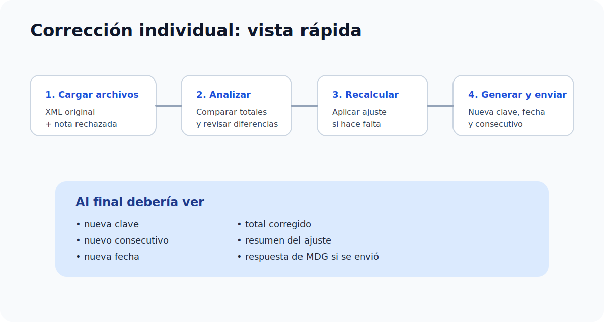

# Corrección individual

Este módulo sirve para trabajar un solo caso a la vez, de forma guiada.

## Cuándo usar este módulo

Utilice este módulo cuando:

- exista una nota de crédito rechazada
- se requiera comparar el documento rechazado contra el documento original
- se necesite recalcular el monto permitido
- se deba generar una nueva versión corregida

## Archivos necesarios

Normalmente se requieren:

- XML del documento original
- nota rechazada en JSON o XML

## Qué debe tener listo antes de empezar

- el archivo XML correcto del documento original
- la nota rechazada correcta
- una nueva terminal
- las credenciales MDG del cliente, si va a enviar

## Paso a paso

1. Ingresar al módulo `Corrección individual`.
2. Cargar el XML del documento original.
3. Cargar la nota rechazada.
4. Revisar el resumen que aparece en pantalla.
5. Completar la nueva terminal.
6. Presionar `Analizar documento`.
7. Presionar `Recalcular ajuste`.
8. Presionar `Generar versión corregida`.
9. Revisar el resultado.
10. Exportar o enviar a MDG.

## Cómo leer el proceso sin perderse

| Qué hacer | Qué debería ver | Qué hacer si falla |
| --- | --- | --- |
| Cargar archivos | Un resumen del documento y la nota | Confirmar que subió el archivo correcto |
| Analizar documento | Diferencias detectadas y datos comparados | Volver a revisar XML, nota y archivo cargado |
| Recalcular ajuste | Nuevo total corregido o confirmación de que no hacía falta ajuste | Revisar si el caso realmente corresponde a redondeo |
| Generar versión corregida | Nueva clave, nuevo consecutivo, nueva fecha y resultado final | Verificar la terminal y repetir el flujo |
| Enviar a MDG | Respuesta del envío o mensaje de error | Revisar ambiente, tenantId, password y resultado mostrado |

## ¿Qué hace cada acción?

### Analizar documento

Revisa el documento original y la nota cargada para identificar diferencias relevantes.

### Recalcular ajuste

Aplica la corrección necesaria cuando el documento rechazado supera el monto permitido.

### Generar versión corregida

Prepara la nueva versión del comprobante para revisión, descarga o envío.

### Enviar a MDG

Remite el documento generado utilizando la configuración MDG ingresada por la persona.

## Cómo saber que todo va bien

Normalmente el flujo va bien si:

- los archivos cargan sin error
- aparece el resumen del caso
- el sistema muestra un resultado corregido
- se genera una nueva clave y un nuevo consecutivo
- el envío devuelve confirmación o respuesta de MDG

## Resultado esperado

Al finalizar este flujo, la persona podrá ver:

- nueva clave
- nuevo consecutivo
- nueva fecha de emisión
- total corregido
- resumen del ajuste aplicado

Cuando el envío es exitoso, la pantalla puede limpiarse automáticamente para facilitar el siguiente caso.
