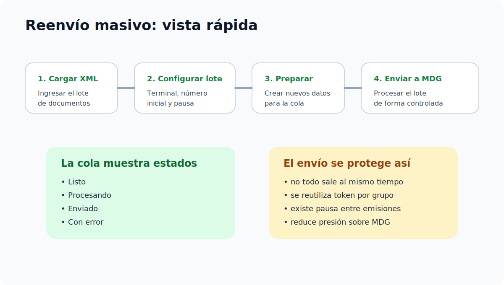

# Reenvío masivo

Este módulo está pensado para ahorrar tiempo cuando se deben reprocesar muchos XML.

## Cuándo usar este módulo

Utilice este módulo cuando:

- se necesita reenviar muchos comprobantes
- se requiere cambiar terminal
- se desea iniciar una nueva secuencia numérica
- se debe procesar un volumen grande de XML con control de resultados

## Qué debe tener listo antes de empezar

- todos los XML del lote
- la nueva terminal
- el número inicial que desea usar
- la decisión de si regenerará o no la clave de seguridad
- las credenciales MDG del cliente

## Información requerida

### XML del lote

Son los documentos que se van a reprocesar.

### Nueva terminal

Es la terminal que se usará para generar los nuevos consecutivos y claves.

### Número inicial

Es el punto de partida de la numeración del lote.

Ejemplo:

- si el número inicial es `1`
- el primer documento quedará con `0000000001`
- el segundo con `0000000002`
- el tercero con `0000000003`

### Pausa entre envíos

Permite espaciar las emisiones hacia MDG.

Rango permitido:

- mínimo `300 ms`
- máximo `500 ms`

### Regenerar clave de seguridad

Si esta opción está activa, la herramienta vuelve a construir el tramo de seguridad de la clave durante el reprocesamiento.

## Ejemplo simple de renumeración

| Documento en el lote | Nueva terminal | Nuevo número |
| --- | --- | --- |
| XML 1 | 14048 | 0000000001 |
| XML 2 | 14048 | 0000000002 |
| XML 3 | 14048 | 0000000003 |

## Paso a paso

1. Ingresar al módulo `Reenvío masivo`.
2. Cargar los XML del lote.
3. Verificar que los archivos hayan sido aceptados por la herramienta.
4. Ingresar la nueva terminal.
5. Ingresar el número inicial.
6. Definir la pausa entre envíos.
7. Activar o desactivar la regeneración de clave de seguridad.
8. Completar la configuración MDG.
9. Presionar `Preparar lote`.
10. Revisar la cola de procesamiento.
11. Presionar `Enviar lote a MDG`.
12. Revisar los resultados finales.

## Cómo leer el proceso sin perderse

| Qué hacer | Qué debería ver | Qué hacer si falla |
| --- | --- | --- |
| Cargar XML del lote | La lista de documentos aceptados | Revisar los XML rechazados uno por uno |
| Preparar lote | Nuevos datos listos para procesarse | Confirmar terminal, número inicial y archivos |
| Revisar cola | Documentos con estado `Listo` | No enviar hasta entender por qué alguno falló antes |
| Enviar lote a MDG | Cambio de estados en la cola | Revisar credenciales, ambiente y mensaje del documento fallido |

## Cola de procesamiento

La cola muestra cada documento del lote con su estado individual.

Estados disponibles:

- `Listo`
- `Procesando`
- `Enviado`
- `Con error`

Cuando el lote contiene muchos documentos, la cola se presenta con paginación para hacer más fácil la revisión.

## Cómo interpretar la cola

- `Listo`: el documento está preparado, pero todavía no se ha enviado
- `Procesando`: el documento se está trabajando en este momento
- `Enviado`: el documento ya fue enviado y obtuvo respuesta satisfactoria
- `Con error`: el documento necesita revisión antes de un nuevo intento

## Cómo se comporta el envío masivo

El sistema no envía todos los documentos al mismo tiempo.

Para cuidar la estabilidad operativa:

- los documentos se procesan de forma controlada
- se utiliza una pausa entre emisiones
- se reutiliza el token dentro de los grupos internos del lote

Esto reduce la presión sobre MDG y mejora la continuidad del procesamiento.

> Consejo: si el lote es muy grande, primero revise unas cuantas filas de la cola antes de reenviar todo de nuevo.
